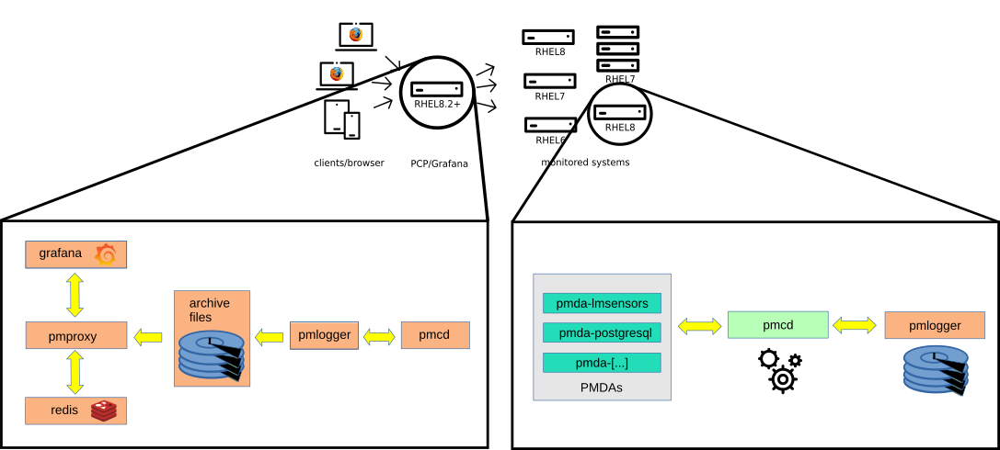

.. include:: <isonum.txt>

Architecture
============

   |copy| Christian Horn

Monitored Hosts
---------------

Monitored hosts run the **Performance Metrics Collector Daemon (PMCD)**, which communicates with one or many **Performance Metrics Domain Agents (PMDAs)** on the same host.
Each **PMDA** is responsible for gathering metrics of one specific domain - e.g., the kernel, services (e.g., PostgreSQL), or other instrumented applications.
The **pmlogger** daemon records metrics from **pmcd** and stores them in archive files on the hard drive.

Since **PCP 5** metrics can also be stored in the redis database, which allows multi-host performance analysis, the **pmproxy** daemon discovers new archives (created by **pmlogger**) and stores them in a redis database.

Dashboards
----------

Performance Co-Pilot metrics can be analyzed with Grafana dashboards, using the **grafana-pcp** plugin.
There are two modes available:

* historical metrics across multiple hosts using the :doc:`datasources/redis` data source
* live, on-host metrics using the :doc:`datasources/vector` data source

The :doc:`datasources/redis` data source sends :ref:`pmseries <pmseries-query-language>` queries to **pmproxy**, which in turn queries the redis database for metrics.
The :doc:`datasources/vector` data source connects to **pmproxy**, which in turn requests live metrics directly from a local or remote **PMCD**.
In this case, metrics are stored temporarily in the browser, and metric values are lost when the browser tab is refreshed.
The :doc:`PCP Redis data source <datasources/redis>` is required for persistence.
