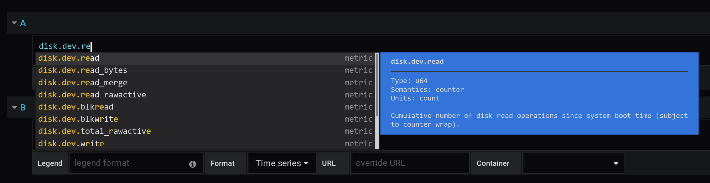
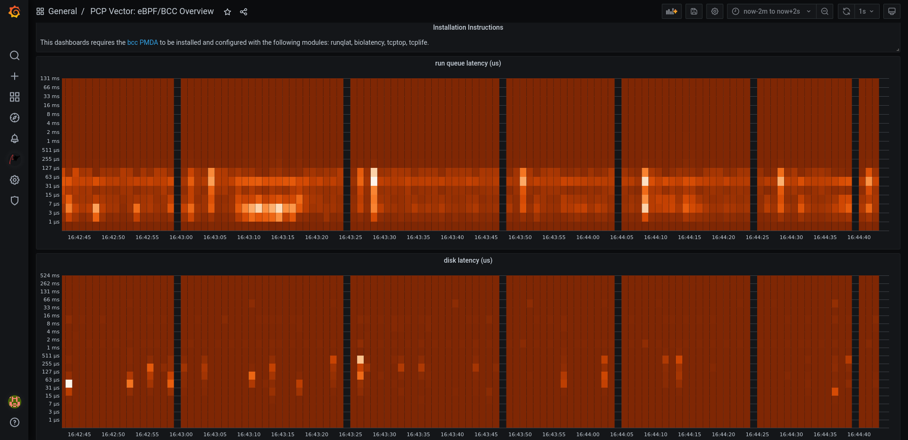
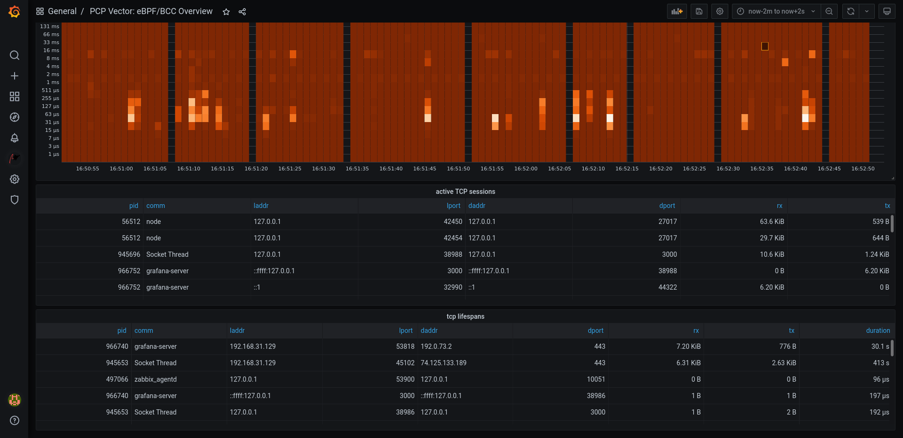
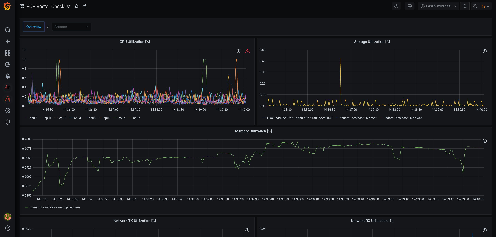
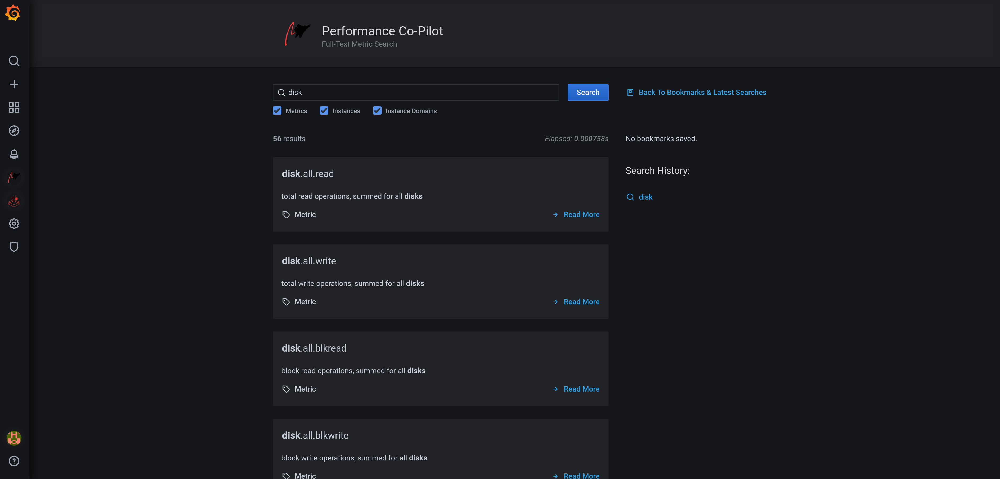

Screenshots
===========

PCP Vector
----------

.. image:: ../src/img/screenshots/vector-overview.png
  :width: 700

Vector dashboards
~~~~~~~~~~~~~~~~~

.. image:: ../src/img/screenshots/vector-containers.png
  :width: 700

PCP bpftrace
------------

.. image:: ../src/img/screenshots/bpftrace-cpu.png
  :width: 700
.. image:: ../src/img/screenshots/bpftrace-disk.png
  :width: 700
.. image:: ../src/img/screenshots/bpftrace-tcp.png
  :width: 700

bpftrace code editor
~~~~~~~~~~~~~~~~~~~~

.. image:: ../src/img/screenshots/bpftrace-probe-autocompletion.png
  :width: 700
.. image:: ../src/img/screenshots/bpftrace-variable-autocompletion.png
  :width: 700
.. image:: ../src/img/screenshots/bpftrace-function-autocompletion.png
  :width: 700

bpftrace flame graphs
~~~~~~~~~~~~~~~~~~~~~

.. image:: ../src/img/screenshots/bpftrace-flame-graph.png
  :width: 700

Metric Search
-------------

